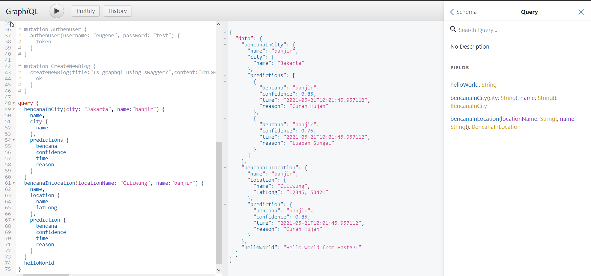

# PREDICT BACKEND
A backend repository for PREDICT application

## Frontend Usage
<p align="center"></p>

## Backend Usage
* Install requirements
    ```
    pip install -r requirements.txt
    ```

* Run application
    ```
    python main.py
    ```
    _go to http://localhost:8000/gql_

* Alembic migration (in future)
    ```
    alembic revision --autogenerate -m "Init Migration"

    alembic upgrade head
    ```

## Contribute to this repository
* See contributing.md