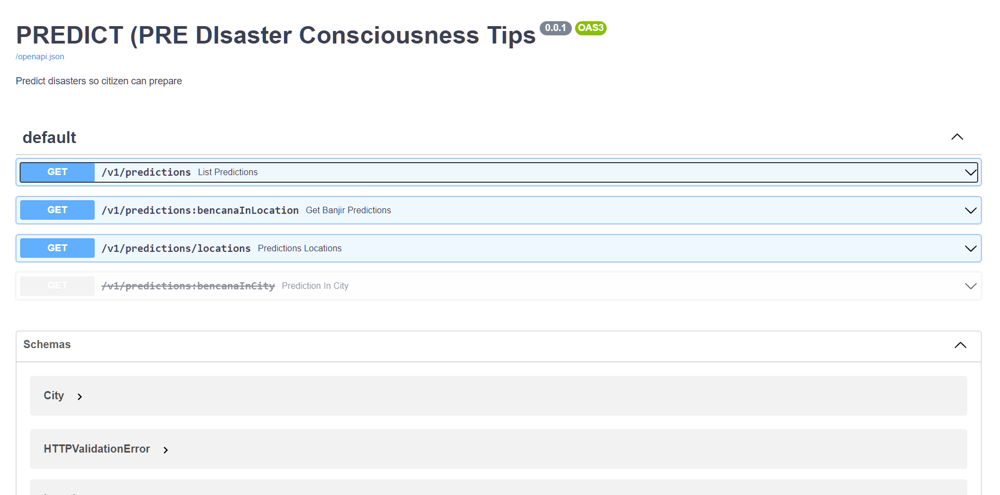

# PREDICT BACKEND
A backend repository for PREDICT application

[](https://github.com/red-hat-bangkit/predict-cc/actions/workflows/cr-deploy.yml)

<p align="center"></p>

## Contribute to this repository
* See [contributing.md](contributing.md)

## Frontend Usage
* Go to [https://predict-bencana.ardenov.com/docs](https://predict-bencana.ardenov.com/docs)

## Backend Usage
* Install requirements
    ```
    pip install -r requirements.txt
    ```
* Decrypt files
    ```
    sudo apt-get install -yqq p7zip-full
    LARGE_SECRET_PASSPHRASE=<YOUR_PASSPHRASE>
    ./decrypt-file.sh
    ```
* Run application
    ```
    python main.py
    ```
    _go to http://localhost:8000/docs_

* Test application
    ```
    python main.py test
    ```

* Generate GQL Schema (deprecated)
    ```
    python main.py generate-schema
    ```

* Alembic migration (deprecated)
    ```
    alembic revision --autogenerate -m "Init Migration"

    alembic upgrade head
    ```

## Docker usage
* Build image
    ```
    docker build -t predictws:0.0.1 .
    ```
* Run container from image
    ```
    docker run --name predict_app -p 80:8080 predictws:0.0.1
    ```
* Stop and remove container
    ```
    docker container stop predict_app && docker rm $_
    ```

## Heroku deployment
* Connect repository to heroku app
    ```
    heroku git:remote -a <HEROKU-APP-NAME>
    ```
* Set heroku stack to container
    ```
    heroku stack:set container
    ```
* Decrypt secrets
    ```
    sudo apt-get install -yqq p7zip-full
    LARGE_SECRET_PASSPHRASE=<YOUR_PASSPHRASE>
    ./decrypt-file.sh
    ```
* Deploy to heroku
    ```
    ./deploy.sh
    ```

* Deploy to GCP CLoud Run
    * [https://cloud.google.com/community/tutorials/cicd-cloud-run-github-actions](https://cloud.google.com/community/tutorials/cicd-cloud-run-github-actions)
